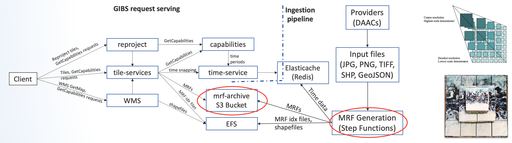

# Data Compression and Formats Research by the GIBS Team

This repository contains documentation related to data compression research carried out by the NASA GIBS team. 

NASA's Global Imagery Browse Services (GIBS) delivers an enormous amount
of Earth observation imagery through publicly accessible, standard web
services. Billions of image tiles have been served to users around the
world, across over 1100 Earth Science data products. GIBS serves as the
backbone to popular NASA websites such as *Worldview* (web client for
GIBS imagery) and *Eyes on the Earth*, and has become popular due to its
straightforward integration into GIS applications such as QGIS and
ArcGIS. This year, GIBS completed its multi-year transition from an
on-premises implementation to a cloud-native implementation, allowing
for greater scalability to accommodate new Earth Science missions with
massive amounts of data, such as PACE, SWOT, and NISAR. This transition
involved creating a new open-source cloud-optimized implementation of
*OnEarth*, the open-source image server of GIBS. Currently, imagery
served is pre-rendered and stored in S3 buckets as PNG and JPG MRFs.

Due to ever-growing storage demands and associated costs, the OnEarth
team recently added support for a number of GDAL-supported image
compression algorithms such as *LERC*, *brunsli*, and *ZenJPEG*, each
serving an important purpose across different parts of the image
collection. For example, LERC provides floating-point precision that is
crucial for scientific usability and is not available through formats
such as JPEG, which suffers from compression loss in pre-rendering as
images are converted and compressed, and PNG, whose 8-bit depth incurs
precision loss. Furthermore, LERC support is a subset of a larger effort
to investigate potential solutions for imagery to be generated
dynamically from cloud-optimized data. For compression and visualization
of JPEG data, ZenJPEG improves the storage of *NoData* values, while
brunsli can compress JPEG images on average 22% with no additional loss.
A deep dive into the pros, cons, and performance evaluation of these
compression algorithms will be performed.

A poster was presented at AGU 2024 highlighting our work on compression,
which can be found
[here](./docs/figures/agu-2024-v0.0.3.pdf). 

## **GIBS and the Meta Raster Format (MRF) \[1\]**

-   **GIBS** provides fast and open access to data products for web
    clients such as **Worldview**. Both were created in 2011, as a combo
    of Goddard's near real-time (NRT) product generation and JPL's
    mapping technology. Tens of millions of daily requests are handled
    through the WMTS, WMS, and TWMS protocols, and fully in the cloud
    since February, 2024.

-   The main data type in GIBS and its image server, **OnEarth**, is
    known as *Meta Raster Format*, or **MRF**, which combines raster
    storage with tile web services and cloud computing. This format was
    developed at JPL in the 2000's, for storing tiled imagery mosaics at
    different spatial resolutions. It has been built directly into GDAL,
    and is supported by software such as ArcGIS and QGIS. OnEarth
    provides tools for generating MRF files and handling time periods.

*_Figure 1_. GIBS request serving with OnEarth and ingestion
pipeline. Compression occurs during MRF generation (circled in red).
MRFs provide access to an indexed heap of regular tiles (blocks)
controlled by an XML file, usually organized as a pyramid of overviews,
with level zero being the full resolution image (right).*

## **Evaluated compression algorithms**

Each evaluated algorithm is summarized below, and full benchmarking
information can be found at the below links:

-   [**LERC summary and
    benchmarks**](./docs/LERC.md)

-   [**Brunsli summary and
    benchmarks**](./docs/Brunsli.md)

-   [**ZenJPEG summary and
    benchmarks**](./docs/ZenJPEG.md)

-   [**Comparisons of each
    method**](./docs/Comparisons+of+each+method.md)

### Summary

**LERC (Limited Error Raster Compression)**

-   Compression format that can divide a raster into a number of pixel
    blocks, in which each pixel can be quantized and bit stuffed based
    on a number of block statistics, including the per-pixel maximum
    error allowable (zero error yields lossless compression).

-   _Usage_: LERC handles floating-point data, which enables
    richer scientific analysis

**Brunsli (JPEG compression)**

-   Fast lossless JPEG recompressor, included in the draft for the new
    JPEG XL standard. It preserves data in a more efficient container
    and allows for an average 22% decrease in file size while allowing
    the original JPEG image to be recovered byte-by-byte. JPEG tiles can
    be served on-the-fly from a Brunsli MRF via the Apache httpd module
    *mod_brunsli*.

-   _Usage_: Brunsli can be applied on any JPEG layer to
    further reduce file size

**ZenJPEG (JPEG with transparency)**

-   Implementation to enable the correct storage of *NoData* values with
    JPEG for improved lossy compression at 8 or 12 bits per channel,
    basically enabling transparency for JPEGs. The bit mask organized as
    8x8 in 2D; compressed by run-length encoding (RLE).

-   _Usage_: ZenJPEG results in smaller file sizes for
    layers with *NoData* or transparency values, as opposed to PNGs,
    which results in larger file sizes.

### **Effect of compression on costs \[2\]**

-   Costs associated with data storage, data requests, and
    egress affect costs for AWS S3 and other services. File
    sizes can be reduced dramatically via compression, especially with
    LERC, at the expense of precision loss. Egress costs are associated
    with serving data from cloud storage to a client, based on the
    amount of data, the number of requests made against buckets and
    objects, and the transfer location of the data.

### **Future work (as of early 2025)**

-   Our performance evaluation on Meta Raster Format (MRF) generation
    via LERC, brunsli, and ZenJPEG compression shows encouraging
    results. All have been incorporated into OnEarth and we are in the
    process of operationalizing them within the larger GIBS system via
    updating the ingestion pipeline.

-   Besides LERC, brunsli, and ZenJPEG, we plan on evaluating other
    algorithms such as QB3 and AVIF. We also plan on performing
    additional benchmarking once all algorithms are fully operational
    within our system.

-   We're evaluating LERC MRFs as a caching format for other common
    Earth data formats such as NetCDF and HDF.

## **References**

\[1\] MRF documentation:
<https://github.com/nasa-gibs/mrf/blob/master/doc/MUG.md>

\[2\] Dynamic client costs:
<https://nasa-impact.github.io/zarr-visualization-report/approaches/dynamic-client/costs.html>
