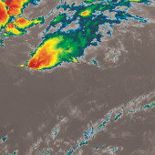
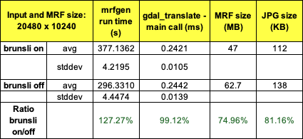

# Brunsli

## **Introduction **

*Brunsli* \[1\] is a fast lossless JPEG recompressor that is included in
the committee draft of the JPEG XL standard \[2\]. JPEG XL is a
compressed image/file format that is an in-progress attempt to become
the next version of JPEG. Brunsli preserves data in a more efficient
container and allows for an average 22% decrease in file size while
allowing the original JPEG image integrity to be recovered byte-by-byte.
There is not a lot of support by Google currently, and documentation
online is sparse.

It is possible to try how much Brunsli will save on a given image via
the brunsli evaluation site \[3\], where images are transcoded in the
browser, with no data transmitted or stored. The brunsli coded is
powered by web assembly (WASM) technology \[5\].

Brunsli has been incorporated directly into GDAL \[6\]. If the
GDAL\_USE\_BRUNSLI flag is set to on, brunsli compression is applied. The
flag defaults to ON if brunsli is found. Besides this flag, all that
needs to be specified is the BRUNSLI\_INCLUDE\_DIR, a path to a directory
with the brunsli/decode.h and brunsli/encode.h header files, as well as
BRUNSLI\_ENC\_LIB (path to the brunslienc-c library file) and
BRUNSLI\_DEC\_LIB (path to the brunslidec-c library file).

### Conversion via *mod_brunsli* \[4\]

The *mod_brunsli* Apache HTTPD module allows serving legacy JFIF JPEG
from recompressed Brunsli files, saving about 22% of the JPEG storage
space by using the DBRUNSLI filter. The reverse conversion is also
possible, generating brunsli files from JFIF JPEGs. As an Apache HTTPD
output filter named \"DBRUNSLI\", it can be enabled using the
*SetOutputFilter* directive \[7\] or using the Apache *mod_filter*
module \[8\].

When enabled, the DBRUNSLI filter activates when it detects brunsli
content, converts it back to the original JPEG, and sends that JPEG to
the user \[4\]. A second filter named \"CBRUNSLI\" is available,
generating brunsli-formatted output from a JFIF input \[4\]. The mime
type used for brunsli-formatted output is "image/x-j".

Currently, these filters have a hard-coded input size limit of 1MB, and
if the input is larger it will be forwarded without conversion \[4\].
Since the input and the output will both be fully present in RAM at the
end of the decoding, a busy server memory footprint might be significant
\[4\]. CPU utilization and request latency increase are low, with the
brunsli encoding being slower than the decoding.

### Example of Brunsli compression

In the following example, an MRF file was generated via OnEarth with and
without brunsli enabled. The corresponding JPEG image is shown in
Figure 1. Table 1 highlights the resulting file size differences when
using brunsli, which compressed the larger .PJG file by 25.04%, and the
.JPG by 18.84%.

** **

*_Figure 1_: Brunsli-compressed JPEG, after conversion via
brunsli.dev \[3\].*

Original MRF file: GOES-East\_B13\_LL\_v0\_NRT\_ZENJPEG2021100000000.mrf

### **Brunsli properties**

-   Brunsli can compress a JPEG file by around 22%, though the exact
    amount depends on the sparsity of the data.

-   Brunsli performs repacking/recoding of JPEG files in a lossless and
    reversible manner, so that clients supporting brunsli can be served
    directly with the optimized version (such that their Apache or nginx
    \[10\] modules seem to serve files with the image/x-j mime type),
    and clients without support can be served with the original JPEG
    file (or served with a brunsli file and decoded with a WASM-brunsli
    to native JPEG decoder pipeline if WASM is an option), while only
    the brunsli (or original JPEG) file needs to be kept around.

-   Similar efforts, such as Dropbox Lepton \[9\], have been deprecated,
    so this is the lone remaining direct compression algorithm for JPEG
    data.

### **Brunsli parameters**

Brunsli has no tunable parameters, as opposed to other compression
algorithms like LERC, which have a precision parameter which can be
adjusted.

### **Datasets**

-   GOES

    -   NC4 files available at \[14\]

-   MODIS Aqua/Terra TrueColors

## **Benchmarks**

There has been previous work on benchmarking compression algorithms for
example at ESRI \[11, 12, 13\], for example for LERC compression, and
the goal here is to perform a similar analysis for brunsli with NASA
GIBS layers and on metrics important to our specific system.

**Compression performance**

Compression and server-side performance testing for Brunsli was based on
creating MRFs via OnEarth's *mrfgen* tool in order to compare file sizes
and compression timing. All numbers were averaged across multiple runs.

For server-side performance analysis, as long as brunsli has been
enabled upon building GDAL, gdal_translate can be invoked to produce a
brunsli-compressed MRF:

> **gdal\_translate - q -f MRF -outsize \<size_x\> \<size_y\>
> \<input_file\> output.mrf**

*_Table 1_. MRF and JPEG compression rates using Brunsli on
GOES data, as tested with 'mrfgen' within an OnEarth container running
on a Mac M1 machine.*

Original MRF file: GOES-East\_B13\_LL\_v0\_NRT\_ZENJPEG2021100000000.mrf

## **References**

\[1\] Brunsli code: <https://github.com/google/brunsli>

\[2\] Rhatushnyak, A., Wassenberg, J., Sneyers, J., Alakuijala, J.,
Vandevenne, L., Versari, L., Obryk, R., Szabadka, Z., Kliuchnikov, E.,
Comsa, I.M., Potempa, K., Bruse, M., Firsching, M., Khasanova, R.,
Asseldonk, R.V., Boukortt, S., Gomez, S., & Fischbacher, T. (2019).
Committee Draft of JPEG XL Image Coding System. *ArXiv, abs/1908.03565*.

\[3\] Brunsli evaluation site: <https://brunsli.dev>

\[4\] mod_brunsli: <https://github.com/lucianpls/mod_brunsli>

\[5\] WASM (web assembly): <https://webassembly.org/>

\[6\] GDAL support for brunsli:
<https://gdal.org/en/latest/development/building_from_source.html#brunsli>

\[7\] Apache SetOutputFilter Directive:
<https://httpd.apache.org/docs/current/mod/core.html#setoutputfilter>

\[8\] Apache mod_filter module:
<https://httpd.apache.org/docs/2.4/mod/mod_filter.html>

\[9\] Dropbox Lepton: <https://github.com/dropbox/lepton>

\[10\] nginx ("engine x"): <https://nginx.org/en/>

\[11\] ESRI LERC documentation: <https://github.com/Esri/lerc>

\[12\] Kopp, Steve, Peter Becker, Abhijit Doshi, Dawn J. Wright, Kaixi
Zhang, and Hong Xu. 2019. \"Achieving the Full Vision of Earth
Observation Data Cubes\" *Data* 4, no. 3: 94.
<https://doi.org/10.3390/data4030094>

\[13\] ESRI LERC benchmarks:
<https://github.com/Esri/lerc/blob/master/doc/LercBenchmarks_Feb_2016.pdf>

\[14\] NASA Center for Climate Simulation (NCCS) portal, GOES
data: <https://portal.nccs.nasa.gov/datashare/gmao/geos-cf/v1/ana/>
