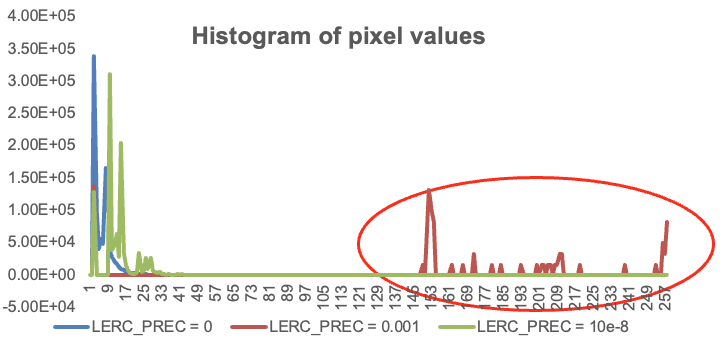

# Comparisons of each method

## **LERC**

-   Outperforms LZW in compression rates and compression speed

-   Handles floating point data; useful for scientific analysis

-   Suited well for sparse datasets with *NoData* values taken into
    consideration

-   Also used in ESRI's CRF format

**Considerations:**

-   Extra work needed to evaluate the data histogram to get the best
    results

*[Figure 1]{.underline}. Histogram of pixel values at different LERC
precision values. Image degradation occurs if an inappropriate value is
chosen*

## **Brunsli**

-   Fast reading and writing when compared to PNG and DEFLATE; no
    tunable parameters

**Considerations:**

-   Can only be used on JPEG layers, and does not support
    12-bits-per-sample JPEGs

-   Care must be taken with compression artifacts

## **ZenJPEG**

-   Proper management of *NoData *values; zero pixels stored losslessly.
    No tunable parameters

-   Works for 8 and 12 bits, and even in conjunction with Brunsli

**Considerations:**

-   Specific only to MRFs and not to other GDAL-supported formats since
    the mask is generated and applied at the MRF codec level

**[Conclusion]{.underline}: **optimal handling of compression within our
architecture should be handled on a case-by-case basis: LERC is better
for science data, brunsli for general JPEG compression, and ZenJPEG for
handling *NoData* values. **As an example, MODIS, VIIRS, and GOES
spectral JPEG layers make up a significant portion of the GIBS archive
and can benefit directly from compression**.

## **What about other cloud-optimized formats?** 

These methods can be applied to other formats, for example COGs. In
fact, LERC can be used directly with COGs. However, GIBS uses MRFs
because:

-   COGs re-organize GeoTIFFs into cloud-optimized structures,
    increasing write time

-   MRFs use sparse .idx files to reduce disk space and support
    incremental file updates, unlike COGs

-   Zarr is not as good for visualizing interactive web maps if chunked
    temporally

-   Tiles can be read quickly from MRF files, which themselves are fast
    to generate and write

-   MRF is great for generating global mosaics at standardized grid and
    time resolutions
