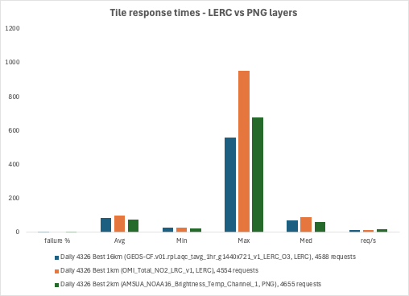

# LERC

## **Introduction **

Limited Error Raster Compression (LERC) is a compression format that can
divide raster into a number of pixel blocks, in which each pixel can be
quantized and bit stuffed, based on a number of block statistics,
including the maximum error allowable \[1\]. The maximum error is a
tolerance value that is applicable per pixel (not an average for the
image). Compression can be lossless or lossy depending on the precision
parameter described in detail below.

For many datasets, it offers the best compression rates as well as
supporting rapid encoding and decoding for any pixel type (not just RGB
or Byte).  LERC compression is supported by GDAL, which can output an
MRF with a LERC-compressed raster.  

LERC can be used in the following scenarios \[1\]:

-   To compress an image as much as possible but so it still looks ok
    (jpeg and relatives). The max coding error per pixel can be large.

-   To prioritize control over the max coding error per pixel
    (elevation, scientific data, medical image data, etc).

In the second case, data is often compressed using lossless methods,
such as LZW, gzip, and others. The compression ratios achieved are often
low. On top the encoding is often slow and time consuming.

LERC allows you to set the max coding error per pixel allowed, called
\"MaxZError\". You can specify any number from 0 (lossless) to a number
so large that the decoded image may come out flat.

### **Main principle (taken directly from reference \[2\])**

This section demonstrates how the same block of 4x4 pixels with floating
point values gets LERC encoded using two different values for MaxZError,
the user specified coding error tolerance. The following image is taken
directly from the LERC patent, in order to explain in detail. 

*_Figure 1_: Example of LERC Encoding For One Block Using
MaxZError = 0.01 m \[2\]*

In some embodiments, LERC encoding can be performed using four
simplified basic steps including, but not limited to, (1) calculating
the basic statistics for a data block; (2) determining how to encode the
block using a user defined MaxZError value, (3) determining the number
of bits needed and bit stuffing the non-negative integers; and (4)
writing the block header. FIG. 9A depicts sample block data 910 for a 4
x 4 block of pixels, according to an embodiment of the invention. It
should be noted that blocks are typically 8 x 8 pixels or larger, but
are shown here as 4 x 4 pixels for simplicity of description. At step 1,
the LERC method includes determining the basic statistics for the data
block of FIG. 9A. The minimum value is 1222.2943 and the maximum value
is 1280.8725. The number of valid pixels (i.e., non-void pixels) is 12
of 16. The number of invalid pixels (i.e., void pixels) is 4 of 16. At
step 2, the LERC method includes determining whether the pixel block
should be encoded uncompressed or with a user-input MaxZError of 0.01 m.
By using equation (1) above:

> **(Max-Min) / (2 x MaxZError) =\> (1280.8725-1222.2943) / (2 x 0.01) =
> 2,928.91.**

Since this value is less than 2\^30, we can quantize the pixel values in
data block 910 and expect an acceptable compression ratio. The block is
quantized using equation (2) above, where each new pixel value is
calculated by:

> **n(i) = (unsigned int)((x(i) - Min) / (2 x MaxZError) + 0.5),**

resulting in the new pixel block 920 shown in FIG. 9B. At step (3), the
method further includes determining the number of bits needed and bit
stuffing these non-negative integers. The number of bits needed can be
determined by equation (3):

> **NumBits = ceil(log2(2929)) = 12**

To represent the number of bits needed another way, 2\^11 \< 2929 \<
2\^12. In this case, 12 bits per number are needed to encode all numbers
of block 910 lossless. There are 12 valid numbers, resulting in 12 x 12
= 144 bits total. As 144 / 8 = 18, 18 bytes are needed to encode the
entire data block. At step (4), the method includes writing the block
header as shown in FIG. 9C. It follows that 7 bytes are needed for the
block header. The total number of bytes needed for block 920 can be
calculated as 18 + 7 = 25 bytes. In this particular case, the header
takes too much space with respect to the raw pixel data, which
exemplifies the need to work with block sizes of 8 x 8 pixels or larger.

An additional example for one block using MaxZError = 1.0m is available
at <https://esri.github.io/lerc/doc/MORE.html>.

### **LERC properties**

-   LERC works on any common data type, not just 8 bit: char, byte,
    short, ushort, int, uint, float, double \[1\]. *Since it supports
    all common data types, it can be used for numerical or scientific
    data, not just for regular images.*

-   Works with any given MaxZError or max coding error per pixel \[1\].

-   Can work with a byte mask that specifies which pixels are valid and
    which ones are not \[1\].

-   Is very fast: per ESRI benchmarks, encoding time is about 20-30 ms
    per MegaPixel per band, decoding time is about 5 ms per MegaPixel
    per band \[1\].

-   Compression is better than most other compression methods for larger
    bit depth data (int types larger than 8 bit, float, double) \[1\].
    For 8-bit data lossless compression, PNG can be better, but is much
    slower.

-   In general for lossy compression with MaxZError \> 0, the larger the
    error allowed, the stronger the compression. Compression factors
    larger than 100x have been reported \[1\].

-   this LERC package \[1\] can read all (legacy) codec versions of
    LERC, such as LERC1, LERC2 v1 to v5, and the current LERC2 v6. It
    always writes the latest stable version. *_Important
    note_: NASA GIBS always uses LERC compression version V1, as higher
    versions are different algorithm/code base and may not work properly
    as a raster format for MRFs.*

-   LERC supports sparse images or raster with many pixels invalid or
    empty. 

-   LERC is a standalone codec with no dependencies on other software
    packages or libraries. It can be ported from C++ to other languages
    such as JavaScript or Python

-   Allows for new capabilities, such as contrast stretching (or
    normalization, which improves contrast by 'stretching' the range of
    intensity values to span a desired range).

### **LERC precision parameter**

The main tunable parameter for LERC is LERC\_PREC. If LERC\_PREC is set to
0, LERC is lossless compression algorithm.  In most cases, to achieve
high compression ratios users advised to set LERC\_PREC to non-zero value
for a lossy compression.  LERC provides a guarantee: the max error in a
pixel value after compression is bound by parameter set in LERC\_PREC.
 This ability to objectively estimate the compression error makes MRF
LERC-compressed rasters great for science data analysis.  The user can
know *exactly* how accurate (within 0.1 for example), the value after
compression will be.

It is crucial to set LERC\_PREC to the value that is appropriate for the
input data.  Simplified understanding of how LERC compression works is
that the pixel value will be rounded to the nearest 2 \* LERC\_PREC\_VALUE
then losslessly compressed.  An example, say input pixel value is a
32-bit float data and the maximum error is set to *LERC_PREC* = 0.1, then
the lossy-compressed pixel value after decompression is guaranteed to be
within 0.1 of the original value.

The precision can be set as both an absolute value and as a percentage.
Care must be taken when specifying this value, based on the range of
values for the data. For example, if input values range between 10e-6 to
10e-9, then a LERC\_PREC value of 0.1 would set those very small values
to 0.1! For such cases, a percentage value should be used instead
(verify that this is true, and that it's not actually that percentages
should not be used with small numbers). The values do not need to be
shifted in any way (or scaled to a different range) prior to applying
LERC\_PREC.

**Notes on precision and floating-point data**

One important topic is the handling of floating-point data, and
precision in general. LERC is not designed to handle 32-bit precision
directly, so the trick is simply to truncate it. For instance, 32-bit
floating point data can be truncated to 12-bit integer. This works well
for many applications; for example, we generally don't need full 32-bit
precision for height values. LERC1 works internally on
integer data, which is supported up to 24 bits (32 bits not yet
supported). Therefore, input floating point data must first be converted
to INT, and in decompression it must be converted back to floating
point.  The "double" type is also not supported currently.

## **Benchmarks**

There has been previous work on benchmarking compression algorithms for
example at ESRI \[1, 3, 6\], but the goal was to perform a further
analysis not just on LERC but on other compression algorithms such as
brunsli and ZenJPEG with NASA GIBS layers and on metrics important to
our specific system. That being said, \[1, 3, 6\] are important
references for this topic in general.

*Server-side performance*:

-   MRF compression rates as compared versus other algorithms like LZW,
    for a single input NC4 file

-   File size analysis for different values of LERC_PREC, given a single
    input NC4 file

-   Compression timing, given a single input NC4 file

-   Effect of data sparsity on compression

*Client-side performance*:

-   MRF de-compression rates

-   De-compression timing

-   Visualization performance

** **

### Datasets

-   GEOS

    -   NC4 files available at \[4\]

-   VIIRS for sparse data tests \[7\], especifically [this data](https://portal.nccs.nasa.gov/datashare/viirs/data/Level2/VJ114IMG/2022/005/)

## **Benchmarks**

Compression and server-side performance testing for LERC was based on
creating MRFs via GDAL in order to compare file sizes and compression
timing. All numbers were averaged across multiple runs.

### **Compression performance**

For server-side compression performance analysis, GDAL's gdal_translate
was used. Starting with uncompressed TIFF data, this GDAL command can be
used to get compressed MRFs without mrfgen, which gives more flexibility
for performance evaluation. GDAL should be invoked as follows:

> **gdal_translate - q -f MRF -co COMPRESS=LERC -co BLOCKSIZE
> \<block_size\> -outsize \<size_x\> \<size_y\> -co OPTIONS=\"V1=ON
> LERC_PREC=0.001 DEFLATE=ON\" \<input_file\> output.mrf**

*_Table 1_. Compression file sizes and average timing for
LERC vs LZW compression. LERC compression rates outperform those of LZW
even when the precision parameter (LERC_PREC) is set to 0, and is
increasingly faster when the precision value increases. At 0, the
algorithm looks for the best block size, compressing the data multiple
times (similarly to PNG), which makes things slower.*

*Granule: GEOS-CF.v01.rpl.aqc_tavg_1hr_g1440x721_v1.20231112_0030z.nc4*

*Output size: 1440x721, data type: float 32; data resolution: 0.25x0.25;
latitude resolution: 0.25; longitude resolution: 0.25*

*_Table 2_. Compression rates and timing for VIIRS data,
using LERC (with zero precision) versus LZW compression. Even at zero
precision, speeds increase relative to LZW as a function of data
sparsity.*

*Size: 402x402, data type: Float32*

*_Figure 1_. MRF insert performance. Top: timing for LERC vs
TIFF as tiles are progressively inserted into an MRF. Bottom: respective
MRF file sizes. Repetitive patterns are due to varying amounts of NoData
values per tile when going around the globe (each row of tiles). For
more details, please visit this wiki page \[9\].*

### **Client-side performance**

Client-side performance is being measured only for LERC, given that
client-side infrastructure has only been set up for this particular
algorithm so far.

*_Table 3_. Timing numbers for rendering a LERC layer onto
the client once a tile request is received (averaged over 40 runs),
obtained by zooming out and panning the whole globe and averaging across
multiple dates. Timing includes converting raw high-precision data into
an image. Open Layers was used.*

*\*OMI = OMI Total NO2 LRC v1 STD*

*\*\*VIIRS nighttime = VIIRS_VNP46A1_LERC_v1*

*_Figure 2_. Tile response time statistics for LERC vs PNG
layers (left) and corresponding percentiles (right). Times are
comparable to current GIBS performance with PNG tiles. Tests were run
in an OnEarth instance within AWS and connected directly to the load
balancer, to minimize network latency.*

#### Expanded explanation of examples in Table 1 - to better highlight the effect of precision

*Input data file (granule)*:
GEOS-CF.v01.rpl.aqc_tavg_1hr_g1440x721_v1.20231112_0030z.nc4

*Data type*: 32-bit floating point

*Image resolution*: 1440 x 721

*Origin*: -180.1250000000000000,90.1250000000000000

*Pixel size*: 0.25,-0.25

*Available variables*: CO, NO2, O3, PM25_RH35_GCC, S02

*Data ranges and visualization (per QGIS \[5\])*:

_CO_: \[0, 0.000003\]

_NO2_: \[0, 0\]\*

_O3_: \[0, 0\]\*

_PM25\_RH35\_GCC_: \[0.269339, 696.068909\]

_SO2_: \[0, 0\]\*

#### *Procedure*

1.  Create an uncompressed 32-bit TIFF for each variable from the input
    NC4 file, for example (see nc2tiff.sh):

**gdal\_translate
NETCDF:\"GEOS-CF.v01.rpl.aqc\_tavg\_1hr\_g1440x721\_v1.20231112\_0030z.nc4\":CO
GEOS-CF.v01.rpl.aqc\_tavg\_1hr\_g1440x721\_v1.20231112\_0030z_CO.tiff**

      2. For comparison purposes, create an LZW-compressed MRF for each,
for example (see lzw_compression.sh):

**gdal\_translate -q -of MRF -co COMPRESS=TIF  -co OPTIONS=\"DEFLATE=ON,
LZW=ON\" -outsize 1440 721
GEOS-CF.v01.rpl.aqc\_tavg\_1hr\_g1440x721\_v1.20231112\_0030z\_CO.tiff
GEOS-CF.v01.rpl.aqc\_tavg\_1hr_g1440x721\_v1.20231112\_0030z\_CO\_LZW.mrf**

      3. \*Apply LERC compression, keeping in mind the following. For
variables like PM25\_RH35\_GCC, with data ranges in \[0, 10e+3\], a value
of LERC\_PREC=0.001 works well, but not so much for data with ranges
\[10e-11, 10e-9\], for example. For such data, the correct value for
LERC\_PREC should be on the order of 10e-13. For this analysis, LERC_PREC
vales appropriate for each dataset were chosen and listed in parenthesis
in Table 4.

  

\* = \[10e-11, 10e-9\]

*_Table 4_: File sizes in bytes for LERC at different
precision values versus LZW. Note that LERC outperforms LZW overall as
far as compression rate.*

Additional benchmarks can be found at this wiki page \[10\].

## **References**

\[1\] ESRI LERC documentation: <https://github.com/Esri/lerc>

\[2\] ESRI LERC additional documentation and examples:
<https://esri.github.io/lerc/doc/MORE.html>

\[3\] Kopp, Steve, Peter Becker, Abhijit Doshi, Dawn J. Wright, Kaixi
Zhang, and Hong Xu. 2019. \"Achieving the Full Vision of Earth
Observation Data Cubes\" *Data* 4, no. 3: 94.
<https://doi.org/10.3390/data4030094>

\[4\] NASA Center for Climate Simulation (NCCS) portal, GOES data:
<https://portal.nccs.nasa.gov/datashare/gmao/geos-cf/v1/ana/>

\[5\] QGIS: <https://qgis.org/>

\[6\] ESRI LERC benchmarks:
<https://github.com/Esri/lerc/blob/master/doc/LercBenchmarks_Feb_2016.pdf>

\[7\] NASA Center for Climate Simulation (NCCS) portal, VIIRS data:

<https://portal.nccs.nasa.gov/datashare/viirs/data/>

\[8\] ESRI LERC Github repository: <https://esri.github.io/lerc/>

\[9\] [Data Generation
Benchmarks](file:////display/VISLABS/Data+Generation+Benchmarks) for
LERC

\[10\] [Data Tiles
Recommendations](file:////display/VISLABS/Data+Tiles+Recommendations)
