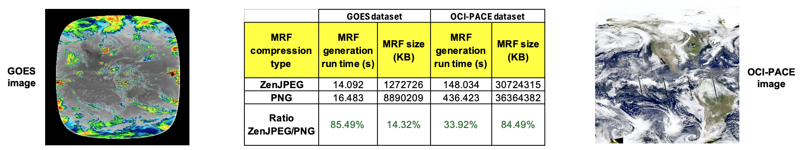

# ZenJPEG

## **Introduction**

ZenJPEG is an implementation to enable the correct storage of NoData
values with JPEG for improved lossy compression at 8 or 12 bits per
channel, basically enabling transparency for JPEGs. The fact that the
metadata and index is kept separately enables applications to easily
fetch and cache it, thus reducing repeated requests for the information
when accessing large numbers of files. All these formats are directly
supported by GDAL which is used by most applications for accessing
geospatial imagery.

The JPEG tiles generated by MRF contain a mask of zero value pixels,
which is stored in a JPEG Zen chunk, using APP3 \"Zen\" tag \[1\]. If
the size of the Zen chunk is zero, all pixels within the respective tile
are known to be non-zero. When reading a JPEG that contains a Zen chunk,
the MRF driver will ensure that the pixel positions that contain zero
matches the mask. In essence, the pixels that contain zero are stored in
a lossless way and can be used as a data mask, when read with the MRF
driver. This eliminates the JPEG edge artifacts when the background is
black, enabling a Zen JPEG encoded MRF to be used as an overlay on top
of other data, as long as black is made transparent \[1\].

Using MRF/JPEG-Zen for storing visual data can produce significant space
savings over the next best option, which would generally be lossless
JPNG, PNG or LERC. Since the Zen chunk is built in accordance to the
JFIF standard, the mask will be ignored by legacy applications, which
will still decode the JPEG image content. Since the mask is generated
and applied at the MRF codec level, it is not accessible to GDAL. This
Zen feature works with either 8 or 12 bit JPEG tiles, and works even
when the brunsli tile format is used. The Zen bitmask is organized in a
8x8 2D bitmask, which is then compressed by run length encoding (RLE).
For most inputs, the size of the Zen chunk containing the mask is
negligible. The potential benefit of being able to treat black as
transparent outweigh this size increase thus this feature cannot be
turned off \[1\].

### **ZenJPEG properties**

-   Enables the correct storage of NoData values for JPEG data, with
    improved lossy compression at 8 or 12 bits per channel.

** **

### **ZenJPEG parameters**

ZenJPEG has no tunable parameters, as opposed to other compression
algorithms like LERC, which have a precision parameter which can be
adjusted.

### **Datasets**

-   GOES (geostationary)

    -   NC4 files available at \[5\]

-   Himawari

-   In general, any data that requires transparency

## **Benchmarks**

There has been previous work on benchmarking compression algorithms for
example at ESRI \[2, 3, 4\], for example for LERC compression, and the
goal here is to perform a similar analysis for ZenJPEG with NASA GIBS
layers and on metrics important to our specific system.

**Compression performance**

Compression and server-side performance testing for ZenJPEG was based on
creating MRFs via OnEarth's *mrfgen* tool in order to compare file sizes
and compression timing. All numbers were averaged across multiple runs.

*_Table 1_. ZenJPEG compression performance versus PNG, for
the GOES (left) and OCI-PACE (right) datasets.*

## **References**

\[1\] NASA GIBS MRF documentation:
<https://github.com/nasa-gibs/mrf/blob/master/doc/MUG.md>

\[2\] ESRI LERC documentation: <https://github.com/Esri/lerc>

\[3\] Kopp, Steve, Peter Becker, Abhijit Doshi, Dawn J. Wright, Kaixi
Zhang, and Hong Xu. 2019. \"Achieving the Full Vision of Earth
Observation Data Cubes\" *Data* 4, no. 3: 94.
<https://doi.org/10.3390/data4030094>

\[4\] ESRI LERC benchmarks:
<https://github.com/Esri/lerc/blob/master/doc/LercBenchmarks_Feb_2016.pdf>

\[5\] NASA Center for Climate Simulation (NCCS) portal, GOES data:
<https://portal.nccs.nasa.gov/datashare/gmao/geos-cf/v1/ana/>
